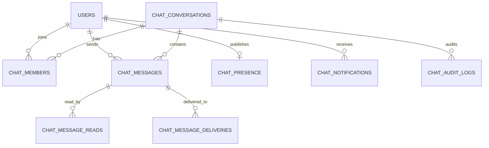

# Chat Module

## Architecture

```mermaid
flowchart LR
    User[Authenticated user] --> Web[Blade + Alpine chat workspace]
    Web --> SessionApi[/chat/api/* session APIs]
    Mobile[Mobile or SPA] --> SanctumApi[/api/v1/chat/* Sanctum APIs]
    SessionApi --> Service[App\Services\Chat\ChatService]
    SanctumApi --> Service
    Service --> Tables[(chat_* tables)]
    Service --> Notifications[chat_notifications]
    Service --> Audit[chat_audit_logs]
    Service --> Presence[chat_presence]
    Service -. future .-> Broadcast[WebSocket broadcaster]
```

The module is isolated behind `config/chat.php` and `CHAT_MODULE_ENABLED`. It only references the existing `users` table for identity and optional `parties/party_addresses` records for display-only city, state, and country data.

## Database Schema



Dedicated tables:

- `chat_conversations`: direct and group conversations, group profile data, privacy, owner, settings.
- `chat_members`: roles, archive/pin state, notification preferences, location visibility.
- `chat_messages`: persisted messages, replies, forwards, edits, soft deletes, attachments.
- `chat_message_reads` and `chat_message_deliveries`: read receipts and delivered state.
- `chat_presence`: online, offline, last seen, and typing state.
- `chat_notifications`: in-app notification payloads with push/browser-ready preferences.
- `chat_audit_logs`: edits, deletes, group and membership changes.

## REST API

Session routes live under `/chat/api/*`; Sanctum routes mirror them under `/api/v1/chat/*`.

- `GET /conversations`
- `POST /conversations`
- `GET /conversations/{conversation}`
- `POST /conversations/{conversation}/archive`
- `POST /conversations/{conversation}/pin`
- `GET /conversations/{conversation}/messages`
- `POST /conversations/{conversation}/messages`
- `PUT /messages/{message}`
- `DELETE /messages/{message}`
- `POST /messages/{message}/forward`
- `POST /conversations/{conversation}/read`
- `PUT /groups/{conversation}`
- `DELETE /groups/{conversation}`
- `POST /groups/{conversation}/members`
- `DELETE /groups/{conversation}/members`
- `PUT /groups/{conversation}/members/role`
- `POST /groups/{conversation}/transfer-owner`
- `POST /groups/{conversation}/leave`
- `GET /presence`
- `POST /presence`
- `GET /users`
- `GET /search`

`GET /users` returns active users from the existing `users` table with live status derived from the Laravel `sessions.last_activity` table and chat presence fallback. The response includes `is_online`, `last_seen_at`, `last_seen_label`, `active_device`, and display-only profile location.

## WebSocket Event Spec

The current implementation is deployable with REST polling. When a broadcaster is added, publish these events from `ChatService` mutation points:

- `chat.message.sent`: `{ conversation_id, message }`
- `chat.message.edited`: `{ conversation_id, message_id, content, edited_at }`
- `chat.message.deleted`: `{ conversation_id, message_id, deleted_by }`
- `chat.message.read`: `{ conversation_id, message_id, user_id, read_at }`
- `chat.presence.updated`: `{ user_id, status, last_seen_at }`
- `chat.typing.updated`: `{ conversation_id, user_id, expires_at }`
- `chat.group.updated`: `{ conversation_id, changes }`
- `chat.member.updated`: `{ conversation_id, user_id, role, status }`

Use private channels named `chat.conversation.{id}` and authorize membership through `chat_members`.

## Security Review

- All chat web routes require existing `auth` and `verified` middleware.
- All mobile/API routes require existing Sanctum auth.
- Every conversation/message access is checked against `chat_members`.
- Group settings and membership changes enforce owner/admin/moderator role rules.
- Messages are soft-deleted and mutation history is written to `chat_audit_logs`.
- SQL injection protection is provided by Eloquent bindings.
- XSS risk is reduced by Blade/Alpine text binding, not raw HTML rendering.
- Upload payloads include size metadata validation and a `virus_scan_status` hook for scanner integration.
- API routes use Laravel `throttle:api`; message-specific limits can be tightened through `config/chat.php`.

## Deployment Guide

1. Set `CHAT_MODULE_ENABLED=true`.
2. Run `php artisan migrate`.
3. Ensure `/chat` is visible to the intended authenticated users.
4. For mobile clients, issue Sanctum tokens and call `/api/v1/chat/*`.
5. Optional: add a queue worker for notification fan-out.
6. Optional: replace REST polling by broadcasting the event spec above through Laravel Reverb, Pusher, Soketi, or Redis-backed Echo.

## Performance Plan

- Keep all high-volume reads scoped by `conversation_id` and `created_at`.
- Use cursor pagination for very large histories if API clients need deeper infinite scroll.
- Move notification fan-out to queued jobs when write throughput grows.
- Store attachments outside the database and keep only metadata in `chat_messages.attachments`.
- Add Redis-backed presence when multi-node WebSockets are enabled.
- Partition or archive `chat_messages` by date/conversation if message volume reaches hundreds of millions.
